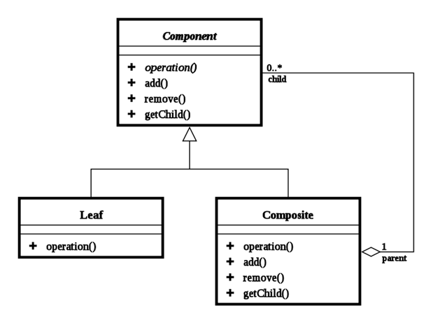

# Katalog
## Demonstracja wzorca projektowego - Kompozyt (Composite)

Kompozyt (Composite)<br><br>
Ogólnie<br><br>
Jest przykładem wzorca strukturalnego. Pozwala na drzewiastą kompozycję obiektów w celu reprezentacji częściowych bądź całościowych hierarchii. Pozwala na wykonywanie operacji zarówno na obiektach złożonych z innych obiektów, jak i na każdym z obiektów z osobna.

Zastosowanie
1.	W celu hierarchicznej reprezentacji sytuacji, gdy jeden lub więcej obiektów jest częścią innego obiektu
2.	Odciążenia klientów (aplikacji klienckich) od konieczności rozróżniania kompozytów od pojedynczych obiektów. Dzięki temu wzorcowi klienci mogą traktować zarówno kompozyty, jak i obiekty jednolicie.


Struktura <br>


Komponent (ang. Component): <br>
•	deklaruje interfejs dla obiektów kompozycji,<br>
•	implementuje domyślne zachowanie dla interfejsu dla wszystkich klas,<br>
•	deklaruje interfejs pozwalający na dostęp oraz zarządzanie komponentami potomnymi o pierwszym stopniu linii prostej pokrewieństwa,<br>
•	opcjonalnie definiuje interfejs pozwalający na dostęp do komponentu rodzica.<br><br>
Liść (ang. Leaf):<br>
•	reprezentuje obiekty kompozycji, które w hierarchicznym drzewiastym układzie są liśćmi (nie posiadają potomków),<br>
•	definiuje zachowanie dla prymitywnych obiektów kompozycji<br><br>
Kompozyt (ang. Composite):<br>
•	definiuje zachowanie dla komponentów posiadających dzieci,<br>
•	odpowiedzialny za przechowywanie komponentów będących dziećmi,<br>
•	implementuje operacje interfejsu Component powiązane z dziećmi,<br><br>
Klient (ang. Client):<br>
•	operuje na obiektach kompozycji poprzez interfejs Component<br><br>

Klienci (ang. Clients) wykorzystują interfejs klasy Component w celu interakcji z obiektami złożonej struktury. W przypadku, gdy operacja odwołuje się do liścia (ang. Leaf), żądanie jest obsługiwane bezpośrednio. Jeżeli natomiast odwołuje się do kompozytu (ang. Composite), z reguły odwołuje się także do komponentów potomnych. Przed oraz po przekazaniu żądania do komponentów potomnych zwykle wykonywane są dodatkowe operacje związane np. z obsługą kompozytu.
<br><br>

Zalety:<br>
•	definiuje hierarchie klas składającą się z obiektów prymitywnych oraz obiektów komponentowych. Prymitywne obiekty mogą być komponowane w obiekty bardziej złożone, które z kolei mogą być również komponowane z innymi obiektami.<br>
•	upraszcza aplikacje klienckie. Klienci mogą operować jednakowo zarówno na strukturach jak i na pojedynczych obiektach. Klienci z reguły nie wiedzą czy operują aktualnie na komponencie kompozytowym, czy na liściu.<br>
•	ułatwia dodawanie nowych rodzajów komponentów. Aplikacje klienckie nie wymagają zmian w przypadku wprowadzenia nowych komponentów.<br><br>

Wady:<br>
•	może przesadnie uogólnić projekt. Prostota tworzenia oraz dodawania nowych komponentów powoduje trudności w zarządzanie projektem oraz ograniczaniu zawartości elementu kompozytowego do określonych typów obiektów.
<br><br>
Konsekwencje:<br>
•	Obiekt Composite jest dla klienta również obiektem bazowym<br>
•	Kod klienta zostaje uproszczony poprzez jednakowe traktowanie obiektów<br>
•	Dodanie nowego rodzaju klasy Component nie wymaga zmiany kodu klienta<br>
•	Trudności z ograniczeniem rodzajów elementów mogących składać się na obiekt Composite <br>
•	Dodanie nowej metody wymaga zmiany we wszystkich klasach<br><br>

Przykładowa implementacja w języku Java:<br><br>

Program przedstawia prosty katalog z częściami motoryzacyjnymi. Składa się z interfejsu zawierającego deklarację podstawowych operacji wykonywanych na obiektach, definicji klas implementujących wspomniany interfejs oraz kodu klienta.
<br><br>

Part.java (Komponent)<br>
```java
interface Part {
    public void addPart(Part part);

    public String getName();
    
    public double getPrice();
    
    public String getData();

	public void setPrice(double d);

	public void setData(String s);
}
```<br><br>

Deklaruje podstawowe operacje na obiektach – częściach (SimplePart) jak i grupach części (Group).<br><br>


SimplePart.java (Liść)<br>
<code>
public class SimplePart implements Part {<br>
    private String name, data;<br>
    private double price;<br>

    public SimplePart(String name) {
    	this.name = name;
    	data = null;
    	price = 0;
    }
    
    public void setPrice(double price) {
		this.price = price;
	}
	
	@Override
	public void addPart(Part part) {
		//Do liścia nie można dodawać obiektów
	}

	@Override
	public String getName() {
		return name;
	}

	@Override
	public double getPrice() {
		return this.price;
	}
	
	@Override
	public String getData() {
		String s = "Nazwa: " +name + "\n" +
				"Cena: " + price + " zł\n" + 
				"Opis: " + data;
		return s;
	}
	
	public void setData(String s){
		data = s;
	}
	
	public String toString(){
		return this.name;
	}
}</code><br><br>

Klasa SimplePart - podstawowej części (liścia) zawiera implementację metod interfejsu. Należy zauważyć, że metoda  addPart(Part part) jest pusta, nie realizuje żadnych operacji. Nie może być inaczej, ponieważ do pojedynczych części (liści) nie możemy dodawać grup (komponentów).
<br><br>
Z kolei w klasie przechowującej części (liście) mamy zaimplementowaną metodę addPart(Part part) która dodaje elemety podrzędne do kompozytu (w tym przypadku jest to grupa części).
<br><br>
Group.java (Kompozyt)<br>
<code>
public class Group implements Part {<br>
    private List<Part> parts = new ArrayList<Part>();<br>
    private String name, data;<br>

    public Group(String name) {
    	this.name = name;
    }
    
    public void addPart(Part part) {
    	parts.add(part);
    }

	public String getName() {
		return name;
	}

	@Override
	public double getPrice() {
		double sum = 0;
		for(Part p : parts){
			sum = sum + p.getPrice();
		}
		return sum;
	}

	@Override
	public String getData() {
		String s = "Nazwa: " +name + "\n" +
					"Cena: " + this.getPrice() + " zł\n" + 
					"Opis: " + data;
		for(Part p : parts){
			s += 
					"\n" + p.getData() + "\n"
					+ "---------------------------------------------------------------------------"
					+ "";
		}
		return s;
	}
	
	public void setData(String s){
		data = s +"\n\n"
				+"-----------------------------------------------------------------------\n";
	}

	@Override
	public void setPrice(double d) {
		//Dla grup cena obliczana jest automatycznie
	}
	
	public String toString(){
		return this.name;
	}
}</code><br><br>

Warto zwrócić uwagę na różne implementacje tych samych metod ze względu na rodzaj obiektu. Na przykład metoda getData() odpowiedzialna jest za wyświetlanie danych o każdej z części jak i o całych grupach. Dla obiektów podstawowych wyświetla ona takie dane jak nazwa, cena oraz opis części. Dla grup obiektów natomiast oprócz danych grupy wyświetlane są także dane wszystkich obiektów podrzędnych w grupie. Podobnie działa metoda getPrice() zwracająca cenę części z katalogu. Dla grupy części zwraca natomiast zsumowaną cenę wszystkich obiektów podrzędnych.
<br><br>

Client.java (Klient) – fragment kodu<br><br><code>
…
public void valueChanged(TreeSelectionEvent e) {
		DefaultMutableTreeNode node =  (DefaultMutableTreeNode)tree
				.getLastSelectedPathComponent();

		if (node == null)
			return;

		Object nodeInfo = node.getUserObject();
		
			Part part = (Part) nodeInfo;
			
			//Wyświetlamy dane klikniętego obiektu w drzewie
			displayData(part);
		
	}
	
	 private void displayData(Part part) {
		 contentPane.setFont(new java.awt.Font("Arial", Font.PLAIN, 18));
		 
		 /*Traktujemy wszystkie obiekty w jednakowy sposób
		  wywołując metodę getData()*/
		 contentPane.setText(part.getData());
	}
…    </code><br><br>
 
Powyższy fragment kodu klienta pokazuje, że wszystkie elemnety drzewa (niezależnie od rodzaju obiektu) są traktowane jednakowo. Na rzecz każdego klikniętego przez użytkownika elementu drzewa wywoływana jest metoda getData() .    
